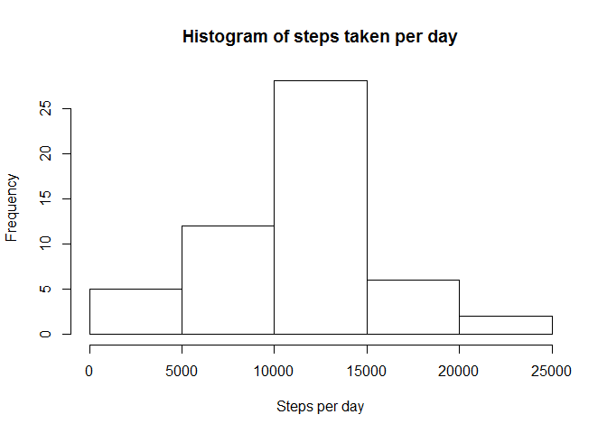
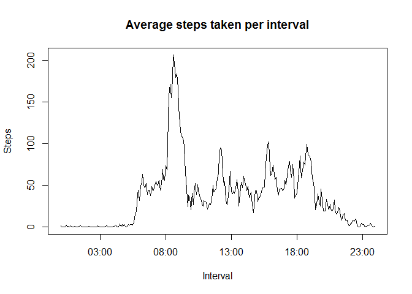
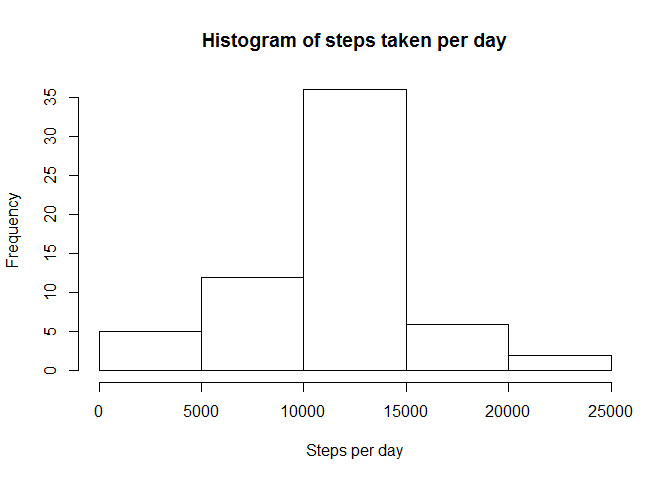
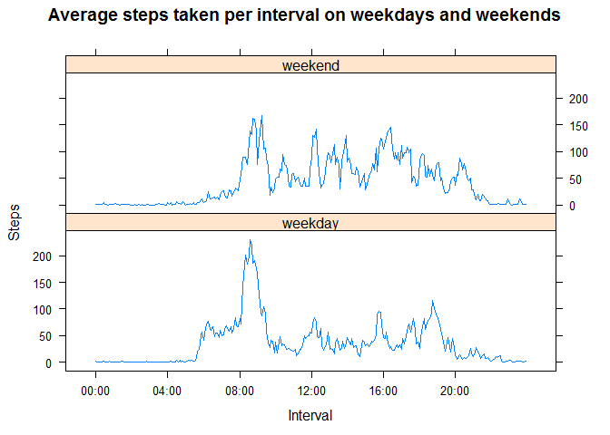

# Reproducible Research: Peer Assessment 1


## Loading and preprocessing the data

Load the data (i.e. read.csv())

```r
activity_data <- read.csv( unz( "activity.zip", "activity.csv") )
```

Process/transform the data (if necessary) into a format suitable for your analysis

```r
activity_data$date_formatted <- as.POSIXct( activity_data$date, format="%Y-%m-%d" )
activity_data$time_formatted <- as.POSIXct( as.character( formatC( activity_data$interval, width = 4, format = "d", flag = "0" ) ), format="%H%M" )
```

## What is mean total number of steps taken per day?

Calculate the total number of steps taken per day

```r
steps_per_day <- aggregate( steps ~ date, activity_data, sum )
```

Make a histogram of the total number of steps taken each day

```r
hist( steps_per_day$steps, main="Histogram of steps taken per day", xlab="Steps per day" )
```

 

Calculate and report the mean and median of the total number of steps taken per day

```r
median( steps_per_day$steps )
```

```
## [1] 10765
```


```r
mean( steps_per_day$steps )
```

```
## [1] 10766.19
```

## What is the average daily activity pattern?

Make a time series plot (i.e. type = "l") of the 5-minute interval (x-axis) and the average number of steps taken, averaged across all days (y-axis)

```r
library( dplyr )
```

```
## 
## Attaching package: 'dplyr'
## 
## The following object is masked from 'package:stats':
## 
##     filter
## 
## The following objects are masked from 'package:base':
## 
##     intersect, setdiff, setequal, union
```

```r
steps_per_interval <- activity_data %>% group_by( time_formatted ) %>% summarise( mean_steps = mean( steps, na.rm = TRUE ), interval = mean( interval ) )
plot( steps_per_interval$time_formatted, steps_per_interval$mean_steps, type="l", main="Average steps taken per interval", xlab="Interval", ylab="Steps" )
```

 

Which 5-minute interval, on average across all the days in the dataset, contains the maximum number of steps?

```r
filter( steps_per_interval, mean_steps == max( mean_steps ) ) %>% select( matches( "interval" ) )
```

```
## Source: local data frame [1 x 1]
## 
##   interval
## 1      835
```

## Imputing missing values

Calculate and report the total number of missing values in the dataset (i.e. the total number of rows with NAs)

```r
sum( is.na( activity_data$steps ) )
```

```
## [1] 2304
```

Devise a strategy for filling in all of the missing values in the dataset. The strategy does not need to be sophisticated. For example, you could use the mean/median for that day, or the mean for that 5-minute interval, etc.

```r
##I will use the set of calculated interval averages above to fill in the NAs
```

Create a new dataset that is equal to the original dataset but with the missing data filled in.

```r
##merge our calculated averages with our original data set
merged_data <- merge( activity_data, steps_per_interval[, c( "mean_steps", "interval")], by = "interval")

##copy the averages into the spaces where the NAs are
merged_data$steps[ is.na( merged_data$steps ) ] <- merged_data$mean_steps[ is.na( merged_data$steps ) ]

##cut out the extra columns so that it is the original data just with the NAs filled in
merged_data <- merged_data[, c( "interval", "steps", "date" ) ]
```

Make a histogram of the total number of steps taken each day and Calculate and report the mean and median total number of steps taken per day. Do these values differ from the estimates from the first part of the assignment? What is the impact of imputing missing data on the estimates of the total daily number of steps?

Calculate the total number of steps taken per day

```r
steps_per_day <- aggregate( steps ~ date, merged_data, sum )
```

Make a histogram of the total number of steps taken each day

```r
hist( steps_per_day$steps, main="Histogram of steps taken per day", xlab="Steps per day" )
```

 

Calculate and report the mean and median of the total number of steps taken per day

```r
median( steps_per_day$steps )
```

```
## [1] 10766.19
```


```r
mean( steps_per_day$steps )
```

```
## [1] 10766.19
```

The new histogram shows that there is how a higher frequency of steps per day being between 10000 and 15000. The median is also now equal to the mean. This is because there are now whole days that have had the averages transplaneted into them causing a spike at the exact mean.

## Are there differences in activity patterns between weekdays and weekends?

Create a new factor variable in the dataset with two levels - "weekday" and "weekend" indicating whether a given date is a weekday or weekend day.

```r
##add the parsed date and time columns back in
merged_data$date_formatted <- as.POSIXct( merged_data$date, format="%Y-%m-%d" )
merged_data$time_formatted <- as.POSIXct( as.character( formatC( merged_data$interval, width = 4, format = "d", flag = "0" ) ), format="%H%M" )

##create new factor column for day of week
merged_data <- mutate( merged_data, day_of_week = weekdays( date_formatted ) )

##create new factor column for whether it's a weekend or a weekday
merged_data$weekday <- ifelse( grepl( "Saturday|Sunday", merged_data$day_of_week ), "weekend", "weekday" )
```

Make a panel plot containing a time series plot (i.e. type = "l") of the 5-minute interval (x-axis) and the average number of steps taken, averaged across all weekday days or weekend days (y-axis). See the README file in the GitHub repository to see an example of what this plot should look like using simulated data.

```r
library( lattice )

##create the data
steps_per_interval <- merged_data %>% group_by( time_formatted, weekday ) %>% summarise( mean_steps = mean( steps, na.rm = TRUE ), interval = mean( interval ) )

##create a time series for the x axis
time_series <- seq( steps_per_interval$time_formatted[ 1 ], steps_per_interval$time_formatted[ length( steps_per_interval$time_formatted ) ], by = "4 hours" )

xyplot( mean_steps ~ time_formatted | weekday, steps_per_interval, main="Average steps taken per interval on weekdays and weekends", xlab="Interval", ylab="Steps", layout = c( 1, 2 ), scales = list( x = list( at = time_series, labels=format( time_series, "%H:%M") ) ), type = "l" )
```

 
